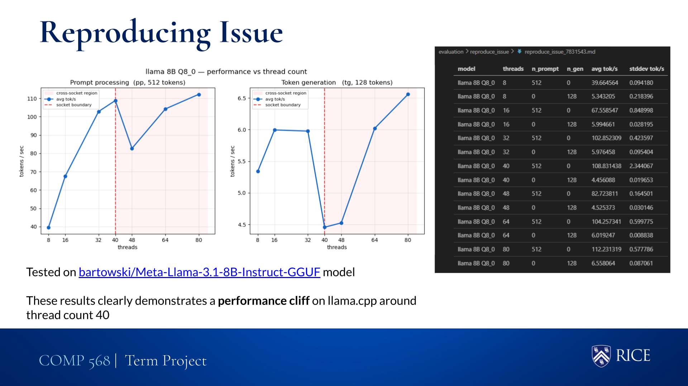
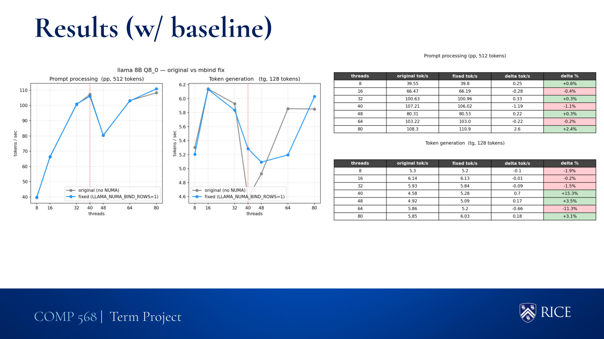
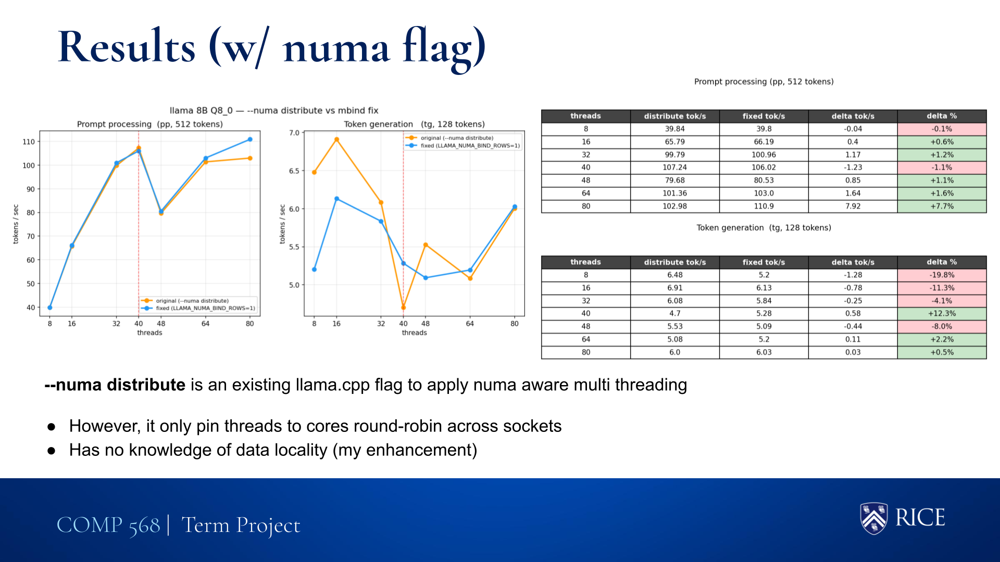

# Deep Learning Systems Artifact Reproduction

## Code Setup and Environment
### Hardware Used

- **CPU:** 2× Intel Xeon Gold 6230 @ 2.10GHz · 20 cores
- **Memory:** 48GB RAM
- **Acceleration:** CPU-only mode (No GPU/CUDA used)
- **Networking:** Port 8080 is exposed on the compute node for local tunneling

### Software Environments

- **Operating System:** Linux (RHEL)
- **Compiler:** `GCCcore/14.3.0`
- **Build System:** `CMake` (handles the compilation and dependency resolution for `llama.cpp`)
- **Version Control:** `git/2.50.1`
- **Framework:** `llama.cpp` (compiled from source)
- **Models:** Quantized GGUF models downloaded from Hugging Face at runtime (see [available models](#deploy-web-server-on-nots))

### Installation steps and dependencies
1. Edit `BASE_DIR` in `build/config.sh` to point to your allocated project space — this keeps large model weights out of your home directory quota.
2. Clone [my fork](https://github.com/04AJ/llama.cpp) into `$BASE_DIR/src/llama.cpp` and the unpatched upstream into `$BASE_DIR/src/archive_llama.cpp`.
3. See [Deploy Web Server on NOTS](#deploy-web-server-on-nots) to build and run the server, or [Reproducing Results](#reproducing-results) to run the benchmarks.

### Issues encountered
- During initial execution, the application defaulted to the user's home directory (`~/.cache`), threatening disk quota limits. [Documentation](https://huggingface.co/docs/huggingface_hub/guides/manage-cache) wasn't clear about setting up llama.cpp cache directory for `llama-server`
    - **Solution**: [`LLAMA_CACHE`](https://github.com/ggml-org/llama.cpp/pull/7826) environment variable 


---
## Project Structure

```
llama-cpp-eval/
├── build/                          # SLURM scripts for building and serving the model
│   ├── build_server.sh             # Builds llama.cpp and launches llama-server on NOTS
│   ├── config.sh                   # Sets BASE_DIR and derived path variables
│   └── models.sh                   # Central model registry — resolves names/numbers to GGUF paths
├── evaluation/                     # Raw benchmark output (CSV) and archived visuals (PNG), one subdir per run
├── improvements/                   # SLURM scripts that build and benchmark each fix
│   ├── reproduce_issue.sh          # Reproduces the baseline thread-count cliff
│   ├── fix_1_default_thread_count.sh  # Fix 1: physical core count instead of logical
│   ├── fix_2_and_3_numa.sh         # Fix 2: NUMA-aware row partitioning + mbind at load time
│   └── fix_4_isolate.sh            # Fix 4: benchmarks llama.cpp's --numa isolate mode
├── visualizations/                 # Python scripts that generate plots from evaluation CSVs
│   ├── baseline_comparison.py
│   ├── numa_comparison.py
│   └── reproduce_issue.py
├── imgs/                           # Key result screenshots referenced in this README
├── logs/                           # SLURM stdout/stderr for all submitted jobs
└── README.md
```

---
## Evaluation Platform

All benchmarking was performed on the **Rice NOTS HPC cluster** using SLURM as the job scheduler. Each job was submitted to the `commons` partition under the `classroom` reservation.

**Node configuration:**
- 2× Intel Xeon Gold 6230 sockets · 20 cores/socket · 40 physical cores total (80 logical with HyperThreading)
- 32 GB RAM allocated per benchmarking job (48 GB for the server job)
- CPU-only inference (no GPU)

This platform is ideal for this investigation because the NUMA performance issues being studied are specific to **dual-socket Xeon hardware**. A single-socket machine (including most cloud VMs) would not exhibit the cross-socket memory access patterns that cause the performance cliff.

Benchmarking was done with `llama-bench`, llama.cpp's built-in throughput tool. It measures three modes:

| Mode | Description | Key Metric |
|------|-------------|------------|
| `pp` | Prompt processing — how fast the model ingests input tokens | `avg_ts` (tokens/sec) |
| `tg` | Text generation — how fast the model produces output tokens | `avg_ts` (tokens/sec) |
| `pg` | Combined prompt + generation — simulates a real user interaction | `avg_ts` (tokens/sec) |

Thread counts were swept across `8, 16, 32, 40, 48, 64, 80` to capture behavior on both sides of the socket boundary (40 physical cores).

---

## Implementation and Deployment

### Code Organization

The official `llama.cpp` repository was cloned into two locations under `/projects/comp468/aj162/src/`:
- `archive_llama.cpp` — unmodified upstream, used as the baseline binary
- `llama.cpp` — [my fork](https://github.com/04AJ/llama.cpp) where fixes are applied

Both are built with `cmake` inside each directory's `build/` subfolder. All SLURM scripts source `build/config.sh` to resolve these paths automatically.

### Deploy Web Server on NOTS

`build/build_server.sh` builds the archive binary and launches `llama-server` on port 8080. Since NOTS compute nodes are not directly reachable from the internet, access is established via SSH tunneling:

```bash
# 1. Submit the job
sbatch build/build_server.sh

# 2. Check the log for the tunnel command
cat logs/build_<jobid>.log

# 3. Run the printed tunnel command on your local machine, e.g.:
ssh -L 8080:<node-hostname>:8080 <netid>@nots.crc.rice.edu

# 4. Open http://localhost:8080 in your browser
```

The server exposes an OpenAI-compatible chat API and a web UI for interactive inference.

**Available models** (configured in `build/models.sh`):

| # | Name | Size | Type |
|---|------|------|------|
| 1 | gemma-1b | ~0.6 GB | VLM |
| 2 | llama-1b | ~0.7 GB | Text |
| 3 | llama-3b | ~3.3 GB | Text |
| 4 | llama-8b | ~8.5 GB | Text |
| 5 | deepseek-8b | ~8.5 GB | Text |
| 6 | qwen3-vl-4b | ~2.5 GB | VLM |

### Reproduce the Performance Cliff

The original issue ([#19110](https://github.com/ggml-org/llama.cpp/issues/19110)) reports a sharp throughput drop when thread count crosses the socket boundary on dual-socket Xeon nodes. To reproduce:

```bash
sbatch improvements/reproduce_issue.sh
```

This benchmarks the unpatched binary across thread counts 8–80 and writes results to `evaluation/reproduce_issue/`. The cliff is visible in prompt-processing throughput when threads exceed 40 (the physical core count of one socket).


*Figure 1: Prompt-processing throughput (tok/s) vs thread count on unpatched llama.cpp. The sharp drop at 40+ threads confirms cross-socket memory contention.*

---

## Improvements and Extensions

### Fix 1: Use Physical Core Count for Default Thread Selection

**Where:** `common/common.cpp`

**Problem:** llama.cpp defaulted to `std::thread::hardware_concurrency()`, which returns the number of *logical* cores (including HyperThreading). On a 2-socket Xeon with HT enabled this returns 80, causing the scheduler to spawn 80 threads across both sockets and triggering immediate cross-socket contention.

**Fix:** Replace with `cpu_get_num_physical_cores()`, which queries the OS for physical core count only (40 on this node).

**Effect:** Default thread count drops from 80 → 40, keeping all threads within one socket and eliminating unnecessary cross-socket traffic.

```bash
sbatch improvements/fix_1_default_thread_count.sh
```

---

### Fix 2: NUMA-Aware Row Partitioning in `ggml_mul_mat`

**Where:** `ggml/src/ggml-cpu/ggml-cpu.c`

**Problem:** During matrix multiplication, threads from both sockets compete to read the same weight rows regardless of where those rows are physically located in memory. This forces socket 1 threads to fetch data across the inter-socket interconnect on every inference pass.

**Fix:** Each thread is assigned a NUMA node at spawn time. Socket 0 threads compute only rows `0–N/2`; socket 1 threads compute only rows `N/2–N`.

**Effect:** Weight reads stay local to each socket, eliminating cross-socket memory access during `ggml_mul_mat`.

---

### Fix 3: Distribute Model Pages at Load Time (`mbind`)

**Where:** `src/llama-model-loader.cpp`

**Problem:** Linux's first-touch policy places all model weight pages on NUMA node 0 by default. Fix 2's row partitioning is wasted if socket 1 still has to fetch all its rows from node 0's memory.

**Fix:** Call `mbind()` once at model load time to physically migrate the upper half of weight pages to node 1, matching the memory layout to Fix 2's compute layout.

**Effect:** Each socket reads only its own local weight pages. Memory and compute layouts are now aligned.

Fixes 2 and 3 are benchmarked together:

```bash
sbatch improvements/fix_2_and_3_numa.sh
```

---

## Reproducing Results

### Run the benchmarks

```bash
# Reproduce the baseline performance cliff
sbatch improvements/reproduce_issue.sh

# Benchmark Fix 1 (thread count)
sbatch improvements/fix_1_default_thread_count.sh

# Benchmark Fixes 2 + 3 (NUMA row partitioning + mbind)
sbatch improvements/fix_2_and_3_numa.sh

# Benchmark llama.cpp's built-in --numa isolate mode (comparison point)
sbatch improvements/fix_4_isolate.sh
```

Each script writes CSV output to the corresponding `evaluation/` subdirectory.

### Generate visualizations

```bash
cd visualizations/
python reproduce_issue.py       # Figure 1: baseline cliff
python baseline_comparison.py   # Figure 2: fixes vs baseline
python numa_comparison.py       # Figure 3: three-way NUMA comparison
```

### Results


*Figure 2: Prompt-processing throughput — unpatched baseline vs Fix 1 + Fix 2 + Fix 3.*


*Figure 3: Three-way comparison — original, fixes applied, and llama.cpp's built-in `--numa isolate` mode.*